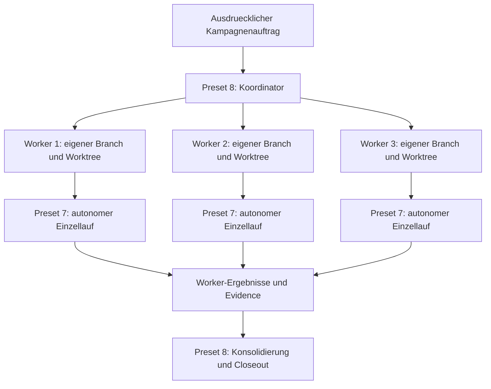

# Parallel Autonomous Run Governance

Permission-bounded coordination for several isolated autonomous Spec Kit runs.

Version `0.2.3` | Priority `80` | Spec Kit `>=0.8.3`
Required worker preset: `autonomous-run-governance >=0.2.2`

Schema 1.2 optionally binds worker scheduling to a current campaign intake
review. Older schemas and `required: false` retain the prior behavior.

## Deutsch

### Wofuer ist dieses Preset gedacht?

Preset 8 koordiniert mehrere autonome Worker als eine nachvollziehbare
Kampagne. Es stellt Isolation, begrenzte Parallelitaet, dauerhaften Zustand,
Stop/Status/Resume, Handoffs und geordnete Konsolidierung bereit.

Es fuehrt nicht selbst den Spec-Kit-Einzellauf aus. Jeder reale Worker
verwendet dafuer Preset 7. Installation startet keine Kampagne und erteilt
keine Commit-, Push-, Merge-, Bypass-, Secret- oder Provider-Rechte.

### Abhaengigkeit zu Preset 7



**Textalternative DE:** Preset 8 nimmt einen ausdruecklichen Kampagnenauftrag
an und erstellt fuer jeden Worker einen eigenen Branch und Worktree. Jeder
Worker fuehrt seinen autonomen Einzellauf unter Preset 7 aus. Preset 8 sammelt
nur validierte Worker-Ergebnisse und fuehrt danach die deklarierte
Konsolidierung und den Closeout aus.

**Text alternative EN:** Preset 8 accepts an explicit campaign instruction and
creates one branch and worktree per worker. Each worker executes its autonomous
single run under Preset 7. Preset 8 collects validated worker results and then
performs declared consolidation and closeout.

### Verbindliche Voraussetzung

Fuer regulaere Kampagnen gilt:

- Preset 7 ist in **jedem** Worker-Repository installiert und aktiviert.
- Mindestversion ist `autonomous-run-governance >=0.2.2`.
- Der Standardmanifestwert ist `requireAutonomousPreset: true`.
- Fehlende, deaktivierte oder zu alte Installationen stoppen den Preflight,
  bevor ein Worker startet.
- `requireAutonomousPreset: false` ist nur fuer interne isolierte
  Test-Fixtures vorgesehen und kein unterstuetzter Produktionsmodus.

### In fuenf Minuten vorbereiten

1. Preset 7, danach Preset 8 installieren:

   ```bash
   specify preset add \
     --from https://github.com/hindermath/spec-kit-preset-autonomous-run-governance/archive/refs/tags/v0.3.2.zip \
     --priority 70
   specify preset add \
     --from https://github.com/hindermath/spec-kit-preset-parallel-autonomous-run-governance/archive/refs/tags/v0.2.3.zip \
     --priority 80
   ```

2. Beide Presets pruefen:

   ```bash
   specify preset info autonomous-run-governance
   specify preset info parallel-autonomous-run-governance
   specify preset resolve parallel-campaign-template
   ```

3. Manifest und lokale Runner-Konfiguration aus den Templates ableiten.

4. Kampagne vor jedem Start validieren:

   ```bash
   bash .specify/presets/parallel-autonomous-run-governance/scripts/orchestrate-parallel-autonomous-runs.sh \
     -Action Validate \
     -Manifest specs/NNN-campaign/parallel-campaign.json \
     -RunnerConfig ~/.config/spec-kit/parallel-runner-profiles.json
   ```

5. Erst danach den Start ausdruecklich delegieren.

### Handbuch

| Kapitel | Inhalt |
|---|---|
| [Dokumentationsstart](docs/README.md) | Rollenbasierter Wegweiser |
| [Erste Kampagne](docs/getting-started.md) | Installation, Preflight und sicherer Start |
| [Topologien und Scheduling](docs/topologies-and-scheduling.md) | Vier Topologien, DAG, Handoffs und Parallelitaet |
| [Manifest und Runner](docs/manifest-and-runners.md) | Schema, Profile, Agenten und Isolation |
| [Lebenszyklus und Operationen](docs/lifecycle-and-operations.md) | Status, Stop und Resume |
| [Konsolidierung und Recovery](docs/consolidation-and-recovery.md) | Provider-Gates, Teil-Merge und Fortsetzung |
| [Post-Merge-Closeout](docs/post-merge-closeout.md) | Sync, Aktionen und `Completed` |
| [Fehlersuche](docs/troubleshooting.md) | Blocker und sichere Reaktion |
| [Kompatibilitaet](docs/compatibility.md) | Versionen, Schemas und Upgrade |
| [Feldnachweise](docs/field-evidence/README.md) | Smoke- und 24-Worker-Feldtest |

## English

### What is this preset for?

Preset 8 coordinates several autonomous workers as one auditable campaign. It
provides isolation, bounded concurrency, durable state, stop/status/resume,
handoffs, and ordered consolidation.

It does not execute the single Spec Kit run itself. Every real worker uses
Preset 7 for that lifecycle. Installation starts no campaign and grants no
commit, push, merge, bypass, secret, or provider authority.

### Binding prerequisite

For regular campaigns:

- Preset 7 is installed and enabled in **every** worker repository.
- The minimum is `autonomous-run-governance >=0.2.2`.
- The default manifest sets `requireAutonomousPreset: true`.
- Missing, disabled, or outdated installations fail preflight before any
  worker starts.
- `requireAutonomousPreset: false` is reserved for isolated internal fixtures
  and is not a supported production mode.

### Five-minute preparation

Install Preset 7 at priority `70`, then Preset 8 at priority `80`. Verify both
with `specify preset info`, derive the campaign and local runner files from the
templates, and run coordinator action `Validate` before explicitly delegating
`Start`.

### Manual

| Chapter | Subject |
|---|---|
| [Documentation home](docs/README.md) | Role-based documentation map |
| [First campaign](docs/getting-started.md) | Installation, preflight, and safe start |
| [Topologies and scheduling](docs/topologies-and-scheduling.md) | Four topologies, DAG, handoffs, and concurrency |
| [Manifest and runners](docs/manifest-and-runners.md) | Schema, profiles, agents, and isolation |
| [Lifecycle and operations](docs/lifecycle-and-operations.md) | Status, stop, and resume |
| [Consolidation and recovery](docs/consolidation-and-recovery.md) | Provider gates, partial merge, and continuation |
| [Post-merge closeout](docs/post-merge-closeout.md) | Sync, actions, and `Completed` |
| [Troubleshooting](docs/troubleshooting.md) | Blockers and safe response |
| [Compatibility](docs/compatibility.md) | Versions, schemas, and upgrade |
| [Field evidence](docs/field-evidence/README.md) | Smoke and 24-worker field test |

## Safety summary

- Maximum supported concurrency is three.
- Every worker owns a separate branch and worktree.
- Runner arguments execute as arrays without shell evaluation.
- Status exposes no secrets, environment values, or executable arguments.
- Stop is cooperative and grants no process-kill authority.
- Alternative solutions require named human selection.
- `MergeAndSync` uses an all-ready barrier and resumable checkpoints.
- Child workers publish; only the coordinator performs ordered consolidation.
- `Completed` requires merge, synchronization, post-merge actions, and final
  validation.

## License

MIT
