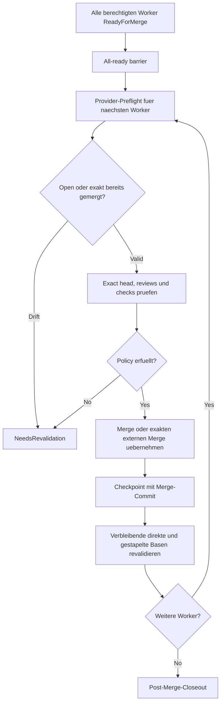
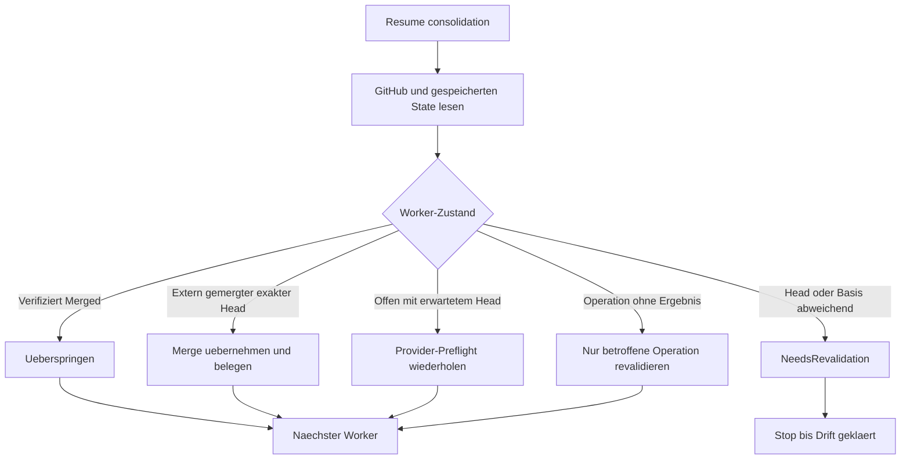

# Konsolidierung und Recovery / Consolidation and Recovery

[Handbuch / Manual](README.md) | [Post-Merge-Closeout / Post-merge closeout](post-merge-closeout.md)

## Geordnete Konsolidierung / Ordered consolidation

**Textalternative DE:** Vor dem ersten Merge muessen alle berechtigten Worker
`ReadyForMerge` sein. Fuer jeden Worker prueft der Provider-Preflight PR-State,
exakten Head, Reviews, Checks und Mergeability. Drift blockiert als
`NeedsRevalidation`. Nach jedem Merge wird ein Checkpoint geschrieben und jede
verbleibende direkte oder gestapelte Basis neu validiert.

**Text alternative EN:** Before the first merge, every eligible worker is
`ReadyForMerge`. For each worker, provider preflight checks PR state, exact
head, reviews, checks, and mergeability. Drift blocks as
`NeedsRevalidation`. Every merge creates a checkpoint and triggers
revalidation of all remaining direct or stacked bases.

## Recovery nach Teil-Merge / Recovery after partial merge

**Textalternative DE:** Resume gleicht gespeicherten State mit aktuellem
Provider- und Git-Zustand ab. Verifizierte Merges werden uebersprungen. Ein
extern gemergter exakter Head wird uebernommen. Ein offener erwarteter Head
wird neu geprueft. Abweichender Head oder Basis wird `NeedsRevalidation`.
Eine unklare Operation wird gezielt und nicht durch Blindwiederholung
behandelt.

**Text alternative EN:** Resume reconciles stored state with current provider
and Git state. Verified merges are skipped. An externally merged exact head is
adopted. An open expected head is checked again. Head or base drift becomes
`NeedsRevalidation`. An uncertain operation is revalidated narrowly rather
than blindly repeated.

## Deutsch

### All-Ready-Gate

`MergeAndSync` veroeffentlicht zunaechst alle Worker-PRs. Vor dem ersten Merge
muessen alle berechtigten Worker den aktuellen Head, Reviews, Checks und
Evidence-Vertrag erfuellen. Dadurch startet die geordnete Merge-Phase nicht mit
einem bereits bekannten unbereiten Nachfolger.

### Provider-Preflight

Der lokale Provider-Adapter liefert fuer den erwarteten Head:

- PR offen oder exakt bereits gemergt,
- kein Draft,
- exakter Head,
- mergebar,
- keine aktuelle Change Request,
- keine aktuellen ungeloesten handlungsrelevanten Threads,
- erfuellte Check-Policy ohne technischen Fehler.

Ein Provider-Status ist Evidence, aber keine Merge-Berechtigung.

### Direkte und gestapelte PRs

Direkte PRs zielen auf den Default-Branch. Gestapelte PRs koennen auf einen
Vorgaenger zeigen. Nach jedem Merge koennen Basis und Mergeability der
verbleibenden PRs wechseln. Deshalb werden sie vor dem naechsten Merge erneut
validiert.

### Teil-Merge und Prozessabbruch

Kampagnen behaupten keine Cross-Repository-Atomaritaet. Nach einem Teilfehler:

1. bereits gemergte exakte Heads gegen Provider und Git verifizieren,
2. Merge-Commits und Checkpoints erhalten,
3. keinen verifizierten Merge wiederholen,
4. nur den ersten unbewiesenen Schritt fortsetzen,
5. bei Head- oder Manifest-Drift stoppen.

### Alternative Loesungen

Nur der benannte menschlich ausgewaehlte Worker wird konsolidiert. Automatische
Bewertung, Kombination oder Mehrfach-Merge ist unzulaessig.

## English

### All-ready gate

`MergeAndSync` first publishes every worker PR. Before the first merge, all
eligible workers satisfy current head, review, check, and evidence contracts.

### Provider preflight

The local provider adapter proves open or exactly merged state, not draft,
exact head, mergeability, no current change request, no unresolved actionable
thread, and a satisfied check policy without technical failure. Provider state
is evidence, not merge authority.

### Direct and stacked PRs

Direct PRs target the default branch. Stacked PRs may target a predecessor.
Because base and mergeability can change after every merge, revalidate all
remaining PRs before the next merge.

### Partial merge and process interruption

Never claim cross-repository atomicity. Verify already merged exact heads,
preserve merge commits and checkpoints, repeat no verified merge, continue
only the first unproven step, and stop on head or manifest drift.

### Alternative solutions

Consolidate only the named human-selected worker. Automatic scoring,
combination, or multi-candidate merge is forbidden.
