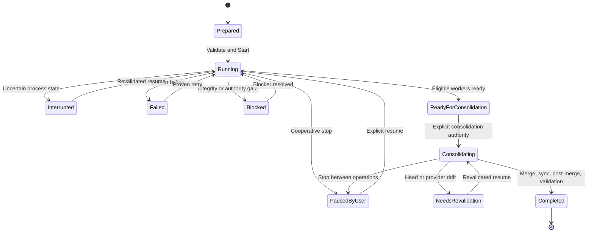
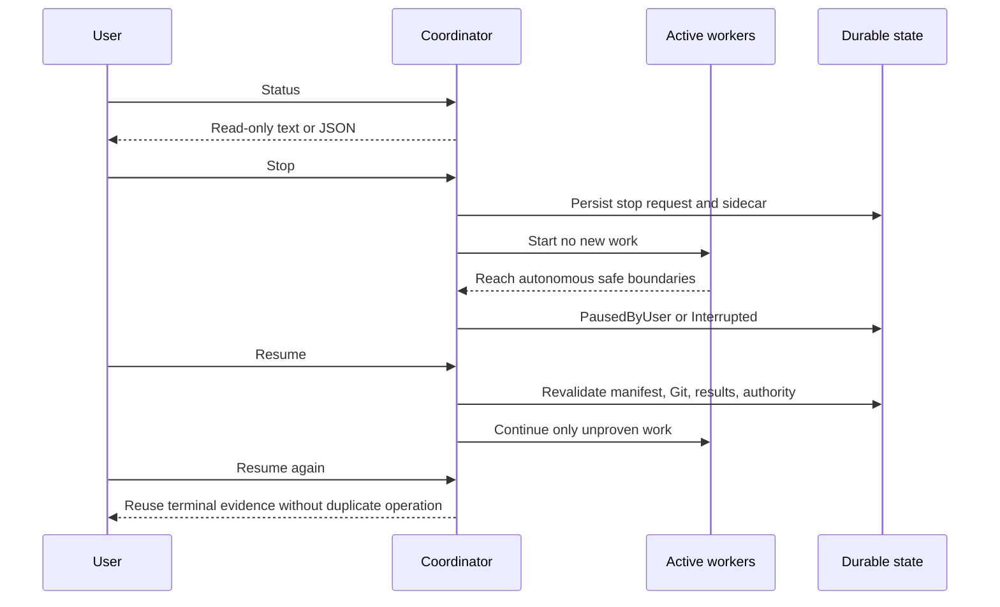

# Lebenszyklus und Operationen / Lifecycle and Operations

[Handbuch / Manual](README.md) | [Konsolidierung / Consolidation](consolidation-and-recovery.md)

## Kampagnenlebenszyklus / Campaign lifecycle

**Textalternative DE:** Nach erfolgreichem Validate und Start wird die
Kampagne `Running`. Stop, Unterbrechung, Fehler oder Hard Gate erzeugen
unterschiedliche Zustaende. Nach bereiten Worker-Ergebnissen folgt
`ReadyForConsolidation`. Nur ausdrueckliche Konsolidierungsberechtigung startet
Merges. Drift fuehrt zu `NeedsRevalidation`. `Completed` folgt erst nach Merge,
Sync, Post-Merge und finaler Validierung.

**Text alternative EN:** Successful validation and start move the campaign to
`Running`. Stop, interruption, failure, and hard gates remain distinct. Ready
worker results lead to `ReadyForConsolidation`. Only explicit consolidation
authority starts merges. Drift becomes `NeedsRevalidation`. `Completed`
requires merge, sync, post-merge work, and final validation.

## Stop, Status und Resume / Stop, status, and resume

**Textalternative DE:** Status liest Manifest, State, Runtime und Git ohne
Aenderung. Stop speichert die Anforderung dauerhaft und startet keine neue
Arbeit; aktive Worker erreichen ihren Preset-7-Grenzpunkt. Resume revalidiert
alle Vertraege und setzt nur unbewiesene Arbeit fort. Ein zweites Resume
wiederholt keine terminal belegte Operation.

**Text alternative EN:** Status reads manifest, state, runtime, and Git without
mutation. Stop persists the request and starts no new work while active workers
reach their Preset 7 boundary. Resume revalidates every contract and continues
only unproven work. A second resume does not repeat a terminal proven
operation.

## Deutsch

### Status

`/speckit.parallel-autonomous-status` ist read-only. Es meldet:

- Campaign-ID, Manifest-Hash, Phase und Status,
- queued, running, completed, failed, blocked, interrupted und ready Worker,
- beobachtete Parallelitaet,
- Runner-Profil und ausdruecklich deklarierte nicht geheime Metadaten,
- Attempt-Zahlen und Events,
- Stop-, Auswahl-, Konsolidierungs- und Post-Merge-Status,
- stale oder fehlende Evidence,
- naechsten exakten Schritt.

Textausgabe ist barrierearm; JSON ist fuer Automatisierung vorgesehen.
Executable-Argumente, Environment-Werte, Secrets und nicht deklarierte
Provider-Einstellungen werden nicht ausgegeben.

### Stop

Stop setzt State und dauerhaften `<state-path>.stop-requested`-Marker. Es
startet keine Worker oder Operationen mehr und beendet keine Prozesse hart.
Auch waehrend der Konsolidierung wird der Stop zwischen Provider-Preflight,
Merge, Synchronisation, Post-Merge-Aktion und finaler Validierung beachtet.

### Resume

Resume prueft Manifest-Hash, Repositories, Worktrees, Branches, Berechtigung,
Runner-Profile, Worker-Results, autonome States, Handoffs und die letzte
belastbare Operation. Verifizierte Ergebnisse werden wiederverwendet. Nur
unbewiesene oder unvollstaendige Operationen werden wiederholt.

Ein akzeptierter Start oder Resume darf den Stop-Sidecar entfernen. Status
allein darf ihn nicht veraendern.

## English

### Status

`/speckit.parallel-autonomous-status` is read-only. It reports campaign
identity, manifest hash, phase, worker states, observed concurrency, declared
runner metadata, attempts, events, stop and selection state, consolidation and
post-merge progress, stale evidence, and the next exact action.

Accessible text supports people; JSON supports automation. Neither exposes
arguments, environment values, secrets, or undeclared provider settings.

### Stop

Stop persists state and a durable `<state-path>.stop-requested` sidecar. It
starts no new worker or operation and kills no process. During consolidation,
it is honored between provider preflight, merge, synchronization, post-merge
action, and final validation.

### Resume

Resume revalidates manifest hash, repositories, worktrees, branches, authority,
runner profiles, worker results, autonomous states, handoffs, and the last
trustworthy operation. It reuses verified results and retries only unproven or
incomplete operations. Only an accepted start or resume may clear the stop
sidecar.
