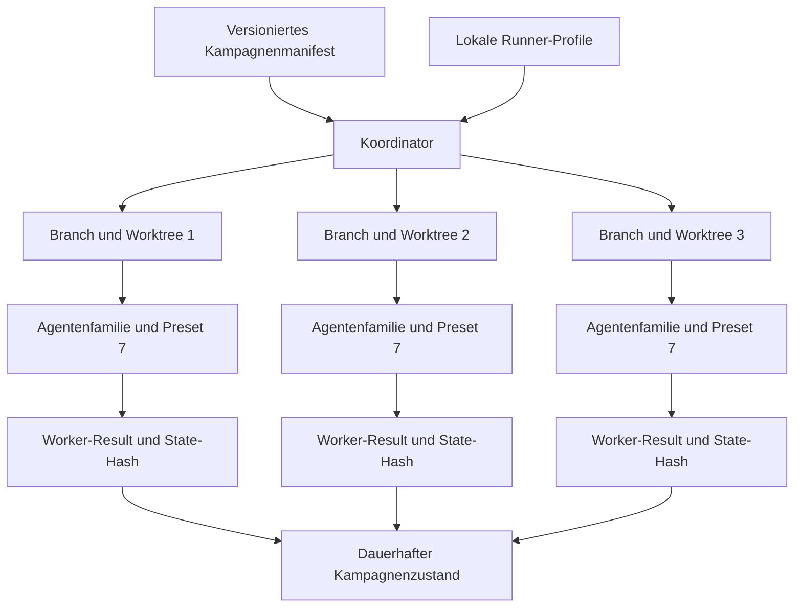

# Manifest und Runner-Profile / Manifest and Runner Profiles

## Optionales Intake-Review in Schema 1.2 / Optional intake review in schema 1.2

```json
"intakeReview": {
  "required": true,
  "resultPath": "specs/campaign/intake-review-result.json"
}
```

Bei aktiver Pflicht muss das Ergebnis vor der Worktree-Erstellung aktuell
sein. Jedes eindeutige Intake wird einmal semantisch geprüft; jeder Worker
erhält trotzdem eine eigene Applicability-Zeile. Review und Manifest müssen
DAG-Kanten und Ausnahmen mit Autor, Grund, Datum, Ablauf und Workern abgleichen.

When required, the result must be current before worktree creation. Review
each unique intake once, retain one applicability row per worker, reproduce the
manifest DAG, and separately govern operator exceptions. Resume revalidates
the stored result hash.

[Handbuch / Manual](README.md) | [Lebenszyklus / Lifecycle](lifecycle-and-operations.md)

## Kampagnenarchitektur / Campaign architecture



**Textalternative DE:** Das versionierte Manifest beschreibt die Kampagne,
waehrend lokale Runner-Profile ausfuehrbare Bindungen liefern. Der Koordinator
erstellt isolierte Branches und Worktrees und startet dort Agenten mit Preset
7. Worker liefern Resultat und Hash ihres autoritativen States. Preset 8
schreibt daraus den dauerhaften Kampagnenzustand.

**Text alternative EN:** The versioned manifest describes the campaign while
local runner profiles provide executable bindings. The coordinator creates
isolated branches and worktrees and runs Preset 7 agents there. Workers return
a result plus the hash of their authoritative state. Preset 8 records durable
campaign state from those contracts.

## Deutsch

### Manifest

Das Manifest ist der gepruefte Kampagnenvertrag. Wichtige Felder:

| Feld | Bedeutung |
|---|---|
| `schemaVersion` | Kampagnenvertrag `1.0` oder `1.1` |
| `campaignId` | Stabile UUID |
| `topology` | Eine der vier Topologien |
| `deliveryMode` | `LocalImplementation`, `PublishPR` oder `MergeAndSync` |
| `maxConcurrency` | Ganzzahl `1..3` |
| `runnerProfile` | Kampagnen-Fallback |
| `requireAutonomousPreset` | Fuer reale Kampagnen immer `true` |
| `workers` | IDs, Repositories, Basen, Branches, Inputs und Abhaengigkeiten |
| `consolidation` | All-Ready, Reihenfolge, Auswahl und Merge-Profil |
| `postMergeActions` | Deklarierte idempotente Closeout-Aktionen |

Der gespeicherte Manifest-SHA-256 bindet Resume und Status an genau den
akzeptierten Vertrag. Drift wird nicht still uebernommen.

### Runner-Konfiguration

Runner-Profile bleiben lokal. Ein Profil enthaelt:

- `agentFamily`,
- optional `model`,
- optional `reasoningEffort`,
- `executable`,
- ein Argument-Array mit Platzhaltern.

Argumente werden direkt ohne Shell-Evaluation gestartet. Keine Secrets,
Environment-Werte oder Tokens gehoeren in Manifest, Status oder versionierte
Runner-Beispiele.

### Kampagnen- und Worker-Profil

`campaign.runnerProfile` ist der Fallback. Ein Worker darf ein eigenes
`runnerProfile` setzen. Dadurch kann eine Kampagne verschiedene
Agentenfamilien verwenden. Fehlende Profile blockieren den Preflight.

`model` und `reasoningEffort` sind rein optionale, ausdruecklich deklarierte
Statusmetadaten. Ohne Angabe erscheint
`Agent-Standard/nicht deklariert`; fremde Agentenkonfiguration wird nie
erraten.

### Unterstuetzte Beispiel-Familien

Das Beispieltemplate zeigt Bindungen fuer Codex, Claude Code, GitHub Copilot
CLI, Google Antigravity, OpenCode und Junie. Es schreibt kein Modell vor und
erteilt keine pauschale Netzwerk- oder Schreibberechtigung.

### Lokaler Runtime-Bereich

`RuntimeRoot` enthaelt Worktrees, Locks, Logs und Prozessresultate. Dieser
Bereich bleibt ausserhalb versionierter Feature-Artefakte. Der normale Checkout
wird weder gewechselt noch zurueckgesetzt.

## English

### Manifest

The manifest is the reviewed campaign contract. It records schema, stable
campaign UUID, topology, delivery mode, concurrency, campaign runner fallback,
the required Preset 7 gate, workers, consolidation, and post-merge actions.

The persisted manifest SHA-256 binds status and resume to the accepted
contract. Drift is never adopted silently.

### Runner configuration

Runner profiles stay local. A profile contains `agentFamily`, optional `model`
and `reasoningEffort`, an executable, and an argument array with placeholders.
Arguments execute directly without shell evaluation.

Do not put secrets, environment values, or tokens in manifests, status, or
versioned runner examples.

### Campaign and worker profiles

`campaign.runnerProfile` is the fallback. A worker may select another profile,
allowing mixed agent families in one campaign. Missing profiles fail preflight.

Model and reasoning values are optional, explicitly declared status metadata.
When absent, status reports `Agent-Standard/nicht deklariert` and never guesses
another agent's configuration.

### Runtime boundary

`RuntimeRoot` contains worktrees, locks, logs, and process results outside
tracked feature artifacts. The normal checkout is never switched or reset.
