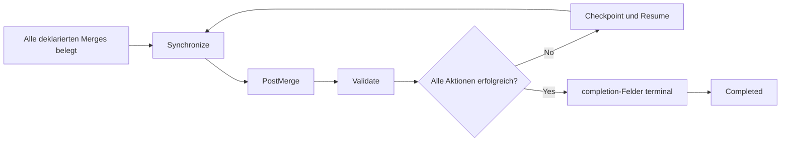

# Post-Merge-Closeout / Post-Merge Closeout

[Handbuch / Manual](README.md) | [Fehlersuche / Troubleshooting](troubleshooting.md)

## Abschlusskette / Completion chain

**Textalternative DE:** Nach belegten Merges folgen nur die im geprueften
Manifest deklarierten idempotenten Aktionen. Sie synchronisieren Repositories,
fuehren Post-Merge-Arbeit aus und validieren den finalen Hauptbranch. Ein
Fehler bleibt als Checkpoint fortsetzbar. Erst wenn alle Completion-Felder
terminal sind, wird `Completed` gesetzt.

**Text alternative EN:** After proven merges, only reviewed,
manifest-declared idempotent actions run. They synchronize repositories,
perform post-merge work, and validate the final main branch. Failure remains a
resumable checkpoint. `Completed` is set only when all completion fields are
terminal.

## Deutsch

### Herkunft der Aktionen

`postMergeActions` duerfen ausschliesslich aus dem akzeptierten
Kampagnenmanifest stammen. Ein Worker-Handoff darf keine ausfuehrbaren
Post-Merge-Kommandos einschleusen.

Jede Aktion nennt:

- stabile `actionId`,
- betroffenen Worker,
- Phase `Synchronize`, `PostMerge` oder `Validate`,
- lokales idempotentes Profil.

### Idempotenz

Resume darf eine fehlgeschlagene Aktion erneut ausfuehren. Deshalb muss ihr
Profil bei wiederholter Ausfuehrung denselben sicheren Zielzustand herstellen.
Der State speichert Versuchszahl, Start, Ende, Exitcode und Zusammenfassung,
aber keine Secrets oder vollstaendigen Argumente.

### Completion-Felder

Schema `1.1` trennt:

| Feld | Bedeutung |
|---|---|
| `mergeComplete` | Alle deklarierten Merges verifiziert |
| `synchronizationComplete` | Ziel-Repositories auf erwartetem Hauptbranch |
| `postMergeComplete` | Weitere deklarierte Aktionen erfolgreich |
| `validationComplete` | Finale Hauptbranch-Gates erfolgreich |

Nur wenn alle anwendbaren Felder `true` sind, wird die Kampagne `Completed`.

### Stop waehrend Closeout

Ein kooperativer Stop wird zwischen zwei Aktionen beachtet. Eine laufende
Aktion wird nicht hart beendet. Ihr Ergebnis wird danach belegt oder als
unsicher markiert.

## English

### Action source

`postMergeActions` come only from the accepted campaign manifest. A worker
handoff must never inject executable post-merge commands. Each action has a
stable ID, worker, `Synchronize`, `PostMerge`, or `Validate` phase, and a local
idempotent profile.

### Idempotency

Resume may retry a failed action, so repeated execution must establish the
same safe target state. State records attempts, timestamps, exit code, and
summary without secrets or complete arguments.

### Completion fields

Schema `1.1` separates verified merges, repository synchronization, additional
post-merge work, and final main-branch validation. Only when all applicable
fields are true does the campaign become `Completed`.

### Stop during closeout

A cooperative stop is honored between actions. It never kills a running
action. Its result is subsequently proven or marked uncertain.
