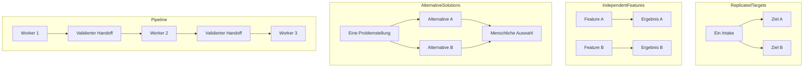
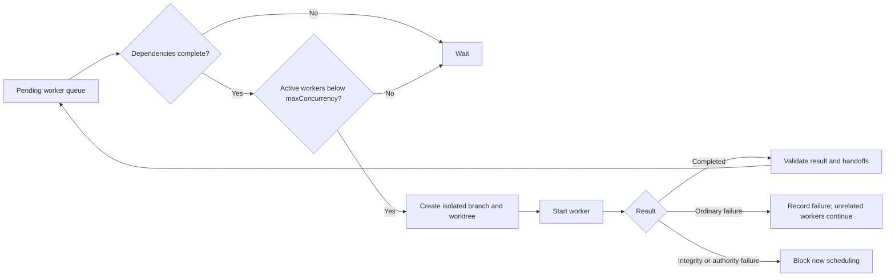

# Topologien und Scheduling / Topologies and Scheduling

[Handbuch / Manual](README.md) | [Manifest und Runner / Manifest and runners](manifest-and-runners.md)

## Vier Topologien / Four topologies

**Textalternative DE:** `ReplicatedTargets` bearbeitet denselben Intake fuer
mehrere Ziele. `IndependentFeatures` bearbeitet unabhaengige Features.
`AlternativeSolutions` erzeugt Kandidaten, von denen ein benannter Mensch
genau einen auswaehlt. `Pipeline` startet Nachfolger erst nach einem
validierten unveraenderlichen Handoff des Vorgaengers.

**Text alternative EN:** `ReplicatedTargets` applies one intake to several
targets. `IndependentFeatures` handles unrelated features.
`AlternativeSolutions` produces candidates and requires a named human to
select exactly one. `Pipeline` starts descendants only after a validated,
immutable predecessor handoff.

## DAG und begrenzte Parallelitaet / DAG and bounded concurrency

**Textalternative DE:** Ein Worker wird nur eingeplant, wenn alle direkten
Abhaengigkeiten abgeschlossen sind und weniger als `maxConcurrency` Worker
aktiv sind. Er erhaelt Branch und Worktree. Normale Fehler stoppen
unabhaengige Worker nicht; Integritaets-, Sicherheits-, Berechtigungs- oder
Evidence-Fehler blockieren neue Starts.

**Text alternative EN:** A worker is scheduled only when direct dependencies
are complete and fewer than `maxConcurrency` workers are active. It receives
its own branch and worktree. Ordinary failures do not stop unrelated workers;
integrity, security, authority, or evidence failures block new starts.

## Deutsch

### `ReplicatedTargets`

Geeignet fuer dieselbe Anforderung in mehreren Repositories, Plattformen oder
Sprachen. Worker teilen keinen Worktree. Ergebnisse werden einzeln validiert
und nicht als atomare Cross-Repository-Transaktion dargestellt.

### `IndependentFeatures`

Geeignet fuer fachlich unabhaengige Features. `dependsOn` bleibt leer.
Fehlschlaege eines Workers duerfen die anderen weiterlaufen lassen, sofern
keine Kampagnenintegritaet betroffen ist.

### `AlternativeSolutions`

Geeignet fuer mehrere Loesungen derselben Spezifikation. Das Manifest setzt
`humanSelectionRequired: true`. Der Koordinator bewertet oder kombiniert
Kandidaten nicht automatisch. Vor Konsolidierung wird ein benannter
`SelectedWorker` angegeben.

### `Pipeline`

Geeignet fuer aufeinander aufbauende Arbeit. Jede Kante im DAG benoetigt genau
einen deklarierten Handoff des Produzenten an den Konsumenten. Handoff-Pfad und
SHA-256 werden validiert. `baseWorkerId` darf nur einen direkten Vorgaenger im
selben Repository nennen; der Nachfolger basiert auf dessen validiertem
exaktem Head und nicht auf einem beweglichen Branchnamen.

### Parallelitaetsgrenze

`maxConcurrency` ist auf `1..3` begrenzt. Drei ist der hoechste real
validierte Wert, keine Schaetzung der theoretischen Systemkapazitaet. Wartende
Pipeline-Nachfolger zaehlen nicht als aktive Worker.

## English

### `ReplicatedTargets`

Use one intake across repositories, platforms, or languages. Workers never
share a worktree. Validate results independently and never claim
cross-repository atomicity.

### `IndependentFeatures`

Use unrelated features with empty `dependsOn`. An ordinary worker failure does
not stop others unless campaign integrity is affected.

### `AlternativeSolutions`

Use several candidates for one specification. Set
`humanSelectionRequired: true`. The coordinator never scores or combines
candidates automatically. A named `SelectedWorker` is required before
consolidation.

### `Pipeline`

Every DAG edge requires exactly one declared producer-to-consumer handoff.
Validate path and SHA-256. `baseWorkerId` may name only a direct predecessor in
the same repository; the descendant starts from its validated exact head, not
a moving branch name.

### Concurrency limit

`maxConcurrency` is limited to `1..3`. Three is the highest value validated in
real campaigns, not an estimate of theoretical system capacity.
